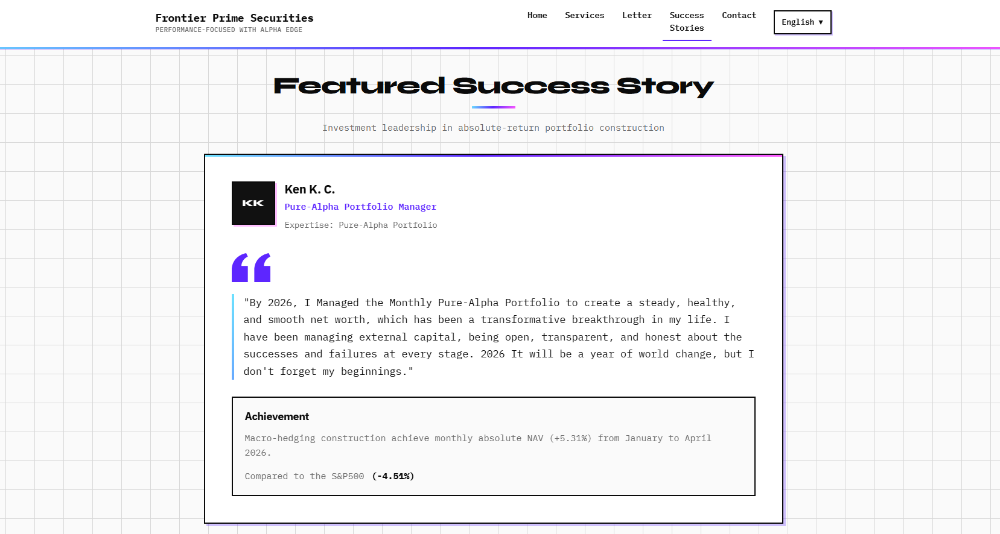
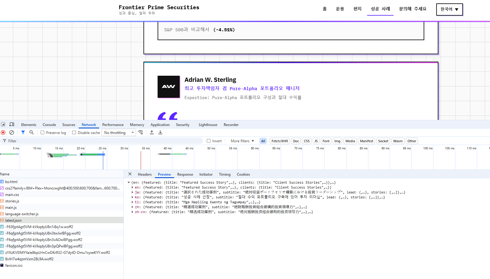
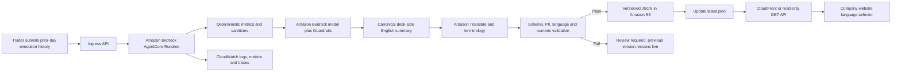

Title: Weekend Annoying Task Challenge: Trading Desk Execute Summary On Cloud, On Chain, On Air
Tag: #productivity

## Link to App or Repo

- **Live app:** https://aws-user-group.com/demo/best_frontier_prime_securities_ai/index.html
- **Public GitHub repository:** https://github.com/dchan-dev/updateTradeWeb

User Mindset Flow


AWS Architecture


Data Flow on AWS Architecture


Get Started High-Level Product Flow


High-Level Entire Organization Flow


Website


Website API call


# Weekend Annoying Task Challenge: DeskPulse

Every trading day ends with the same deceptively simple obligation: turn the desk's execution history into a concise, professional update for shareholders and partners, then publish it reliably across multiple languages. The task is repetitive, time-sensitive, and easy to get wrong when the desk is already focused on post-trade controls, breaks, allocations, and the next session's risk.

I built **DeskPulse**, an AWS-native application that converts a trader's prior-day execution record into a sanitized, desk-grade daily execution message, translates it into six language variants, writes a versioned JSON document to Amazon Simple Storage Service (Amazon S3), and makes the latest approved output available to the company website through a read-only HTTP GET path. The trader submits the execution history, waits about three minutes, and checks the public website. That is the entire user journey.

The project deliberately solves one annoying task well. It does not place orders, recommend trades, alter books and records, calculate regulatory capital, or replace transaction reporting. Its scope is controlled publication of a factual post-trade communication derived from a supplied execution history. That narrow boundary made it an ideal submission for the Weekend Challenge and, more importantly, made it possible to build a useful working vertical slice without turning a weekend project into a full order management system.

## Vision & What the App Does

### The annoying task

A trading desk often needs to explain yesterday's execution activity in language that a non-trader can understand without losing the precision expected by market professionals. The raw source may contain timestamps, symbols, side, quantity, venue, strategy notes, fill status, average price, participation observations, and informal commentary from the trader. Before that material can appear on a corporate website, somebody has to remove personal or confidential identifiers, normalize the tone, extract the meaningful performance story, translate it, format it, and publish it.

That manual process creates several forms of operational drag:

1. **Copy-and-paste risk.** An email address, client name, legal entity, broker contact, or internal desk comment can be carried into a public channel.
2. **Inconsistent market language.** One writer may say the desk "did great," while another describes measured spread capture, implementation shortfall, participation rate, or market impact. The second form is more credible and auditable.
3. **Translation delay.** Producing Simplified Chinese, Traditional Chinese, English, Japanese, Korean, and Tagalog variants by hand turns a short update into a serial workflow.
4. **Publication friction.** Even after the content is ready, somebody still has to edit a content management system or ask a web operator to upload it.
5. **Timing uncertainty.** The trader has no deterministic hand-off. The update may be ready in ten minutes, or it may disappear into a queue.

DeskPulse changes the operating model from manual composition to exception-based review. The trader provides the previous trading day's execution history. Amazon Bedrock AgentCore Runtime receives that payload and orchestrates a bounded transformation pipeline. The application removes PII and organization-specific names, filters poor language, rewrites the note in professional sell-side or buy-side execution vocabulary, produces a concise performance summary, translates the approved canonical summary into six variants, validates the output against a JSON schema, and stores it in Amazon S3. The company website then retrieves the current JSON object over a GET request.

### The three-minute workflow

The successful path is intentionally boring:

1. A trader exports or pastes yesterday's desk execution history into the DeskPulse submission screen.
2. The request returns a job identifier immediately, while the agent continues processing asynchronously.
3. The trader waits up to three minutes.
4. The trader opens the company website and confirms that the latest daily execution message is visible in the required language tabs.

A clear status model supports that journey: `RECEIVED`, `SANITIZING`, `NORMALIZING`, `SUMMARIZING`, `TRANSLATING`, `VALIDATING`, `PUBLISHING`, `PUBLISHED`, or `FAILED`. The three-minute figure is a user-facing service objective for this project, not a claim that every model call always takes that long. The workflow is instrumented so I can track p50, p95, and maximum end-to-end latency and identify whether time is being spent in input validation, the agent, translation, S3 publication, or website cache refresh.

### The output is a communication, not an execution report

That distinction matters in financial services. DeskPulse can summarize observable facts such as the number of parent orders, aggregate notional represented in the supplied data, completion ratio, venue mix, average participation, arrival-price slippage if the input includes a valid benchmark, or the portion of flow executed through limit, market, VWAP, TWAP, or participation-style strategies. It can discuss liquidity conditions, spread environment, urgency, residual quantity, and market impact in cautious language.

It must not invent best execution conclusions. A statement such as "execution quality was excellent" requires a defined benchmark and sufficient evidence. DeskPulse instead uses formulations such as "the supplied records show that 96% of submitted quantity was completed, with median slippage of 4.2 basis points versus the provided arrival-price benchmark." If a benchmark is absent, the system says so and omits the metric. If records are incomplete, the status is `REVIEW_REQUIRED` rather than pretending that the tape is complete.

The application also avoids exposing order-level alpha, client identity, restricted-list information, material non-public information, or details that could enable reverse engineering of the desk's execution strategy. Public output is aggregated and delayed to the prior trading day. This is not only a privacy measure. It reduces information leakage around live liquidity demand, broker routing behavior, venue preference, and remaining inventory.

## How I Built It

### Architecture first, prompt second

The fastest way to make a fragile agent is to start with one giant prompt and treat every output as publishable text. I took the opposite approach. I first wrote down the system boundary, data contract, failure states, and publication invariant: **the public pointer must never reference an object that has not passed deterministic validation**.

The design has four logical layers:

- **Ingress:** authenticate the trader, accept the execution history, reject unsupported files, and issue a job identifier.
- **Agent processing:** sanitize, normalize, summarize, and produce a canonical desk-side English message.
- **Localization and validation:** generate the six required language variants, enforce terminology and schema rules, and run final safety checks.
- **Publication:** write an immutable dated object, then atomically update the `latest.json` pointer used by the website.

Amazon Bedrock AgentCore is a natural fit for the agent layer because it provides a managed platform for deploying and operating agents while allowing the builder to choose the agent framework and model. AgentCore Runtime is designed to host agents and tools in purpose-built environments, and its observability integrates with Amazon CloudWatch; custom telemetry can be emitted using the AWS Distro for OpenTelemetry. citeturn1search1turn1search2turn1search5

### Input contract

I defined the input as structured JSON rather than allowing an unrestricted document upload in the first release. A CSV adapter can map exported records into the same contract, but the internal agent always receives normalized fields. A representative payload looks like this:

```json
{
  "schema_version": "1.0",
  "trading_date": "2026-07-31",
  "desk": "APAC_EQUITIES",
  "base_currency": "USD",
  "records": [
    {
      "execution_id": "EXE-000184",
      "instrument": "REDACTED_PUBLIC_SYMBOL_OR_BUCKET",
      "side": "BUY",
      "order_quantity": 250000,
      "executed_quantity": 250000,
      "average_price": 42.18,
      "arrival_price": 42.20,
      "strategy": "VWAP",
      "venue_group": "LIT",
      "start_time_utc": "01:15:00",
      "end_time_utc": "03:40:00",
      "note": "Order completed without residual; liquidity improved after open."
    }
  ]
}
```

The schema makes required fields explicit and separates numeric facts from narrative notes. That is important because the model is not asked to calculate values that ordinary code can calculate more safely. A preprocessing function computes completion rate, notional, basis-point slippage, counts, and weighted averages with deterministic decimal arithmetic. The agent receives both the source facts and the computed metric block, then explains them. This pattern reduces hallucination risk and makes unit tests straightforward.

The input validator rejects impossible values such as negative executed quantity, executed quantity above configured tolerance, malformed dates, unknown side codes, or mixed trading dates. It also flags records with missing benchmark fields so the summary cannot accidentally imply an arrival-price comparison. Duplicate execution IDs are detected before any model invocation, preventing double counting in desk-level totals.

### Agent workflow in AgentCore Runtime

The runtime entry point accepts the job envelope, assigns a correlation ID, and executes a state machine inside the application. The steps are deliberately explicit rather than left to an open-ended autonomous loop.

#### 1. Receive and quarantine

The original payload is placed in a restricted S3 prefix encrypted with an AWS Key Management Service key. It is not exposed to the website bucket. The object key includes trading date, job ID, and a content hash. This supports replay protection and lets the application detect an identical resubmission.

The agent receives only the fields needed for transformation. IAM permissions follow least privilege: the runtime role can read the quarantine prefix, write to the processed prefix, invoke the selected Amazon Bedrock model and guardrail, call Amazon Translate, and emit telemetry. It cannot modify the website code or enumerate unrelated buckets.

#### 2. Remove PII and organization identifiers

The project requirement specifically calls for removal of email addresses and company names. I use two layers. First, deterministic detectors remove obvious email patterns, phone numbers, account-like strings, and configured legal-entity names. Second, Amazon Bedrock Guardrails sensitive information filters inspect model inputs and outputs. Guardrails can block or mask detected PII, replacing it with a type marker such as `{EMAIL}`; custom regular expressions can extend detection to organization-specific identifiers.

Company names require special handling because generic PII filters are not the same as a confidential-entity dictionary. I therefore maintain a small denylist of the company, affiliates, broker aliases, customer aliases, and desk nicknames. The list is loaded as configuration, not embedded in the prompt. A post-generation scanner checks every language output before publication. A hit moves the job to `REVIEW_REQUIRED` and keeps the previous `latest.json` unchanged.

This architecture acknowledges an FSI reality: probabilistic redaction is useful, but it is not an entitlement control and it is not perfect. Deterministic checks, data minimization, a restricted raw-data zone, and fail-closed publication remain necessary.

#### 3. Remove poor language without deleting meaning

Trader notes can be terse, emotional, or packed with shorthand. The goal is not to erase adverse execution facts. It is to remove profanity, insults, blame, and unprofessional phrasing while preserving operational meaning. "Broker was useless and missed the whole move" cannot become "execution was successful." A faithful normalization might be: "The order did not maintain the requested participation during the price move; broker follow-up is required."

I configured content and word filters and added prompt instructions that distinguish tone correction from fact correction. Bedrock Guardrails supports content filters, denied topics, word filters, and sensitive-information filters, allowing the application to apply consistent safeguards around model input and output. citeturn1search15turn1search16

The denied-topic policy also blocks the generation of personalized investment recommendations. This is a post-trade communication tool, not a research or advisory channel. If the input note contains a forward-looking trade recommendation, the agent removes it from the public summary and records a non-public validation warning.

#### 4. Upgrade the note to desk-side language

The canonical prompt asks for professional execution language grounded only in supplied records. It provides a controlled glossary:

- `filled quantity` instead of "what got done"
- `residual quantity` instead of "what was left"
- `arrival-price slippage` only when an arrival benchmark exists
- `implementation shortfall` only when all required components are available
- `participation rate` for executed market-volume participation
- `market impact`, `spread capture`, `liquidity`, `urgency`, `venue mix`, `block liquidity`, and `opportunity cost` only when supported by inputs
- `basis points` with the benchmark and sign convention stated

The prompt also contains forbidden behaviors: do not infer client intent, do not claim best execution, do not name counterparties, do not expose live positions, do not turn correlation into causation, and do not manufacture a benchmark. Temperature is kept low for repeatability. The expected model response is structured JSON, not prose surrounding JSON.

The sign convention is part of the schema. For a buy, positive cost means the execution price is above the benchmark; for a sell, positive cost means the execution price is below the benchmark. Encoding this explicitly prevents a common trust-destroying error where favorable and unfavorable slippage are inverted between sides.

#### 5. Summarize performance

The summary has three layers:

1. **Headline:** one sentence describing completion and overall execution conditions.
2. **Desk recap:** two to four sentences covering flow, benchmarked performance, liquidity, and material exceptions.
3. **Metrics:** structured values for orders, quantity, completion, notional, slippage, strategy mix, and exception count.

A typical canonical output might state that the desk completed a specified percentage of submitted quantity, that the benchmarked subset recorded a given weighted slippage, and that liquidity was concentrated around the opening auction or a later volume window. It does not bury exceptions. Material residuals, rejected records, missing benchmarks, or unusual deviations are surfaced in an `exceptions` array.

To keep the public message within project scope, account-level, client-level, and security-level details are aggregated into desk-safe buckets. Exact instruments can be omitted or grouped by asset class, region, or liquidity band. The public message is designed for shareholder and partner transparency, not transaction cost analysis drill-down.

#### 6. Translate into six language variants

The required outputs are:

- Mainland Chinese: Simplified Chinese, `zh`
- Taiwan Chinese: Traditional Chinese, `zh-TW`
- English: `en`
- Japanese: `ja`
- Korean: `ko`
- Tagalog: `tl`

Amazon Translate supports these language codes and language pairs. It also supports custom terminology, which is especially useful for keeping desk terms, product names, and approved translations consistent. citeturn1search19turn1search21

English is the canonical source. For each target, the localization step protects numeric values, dates, basis-point units, and schema keys. A custom terminology file standardizes translations for concepts such as arrival price, average execution price, residual quantity, participation rate, and market impact. The model can perform a final fluency pass, but it is instructed not to alter numbers or metric direction.

Traditional Chinese is not produced by a character-conversion shortcut. It receives its own `zh-TW` translation and terminology choices. Similarly, Japanese and Korean outputs avoid literal transliteration where a recognized markets term is more appropriate. Tagalog output favors plain professional communication because some highly specialized trading concepts may be clearer when the approved English term is retained in parentheses.

After translation, a consistency validator extracts every number and compares it with the canonical source. A missing percentage, changed decimal separator, reversed sign, or altered date fails validation. This is one of the highest-value controls in the pipeline because a fluent translation with the wrong slippage number is worse than no translation.

#### 7. Validate and publish

The final output must pass:

- JSON Schema validation
- required language coverage
- PII and confidential-entity rescan
- profanity and prohibited-topic check
- numeric consistency check
- maximum field-length limits
- valid UTF-8 encoding
- trading-date monotonicity
- content hash generation

The application first writes an immutable object such as:

```text
s3://deskpulse-public-prod/daily/2026/07/31/execution-message.v1.json
```

Only after that write succeeds does it update:

```text
s3://deskpulse-public-prod/daily/latest.json
```

The website never reads a half-built document. If translation for one language fails, no new `latest.json` is published. The previous known-good update remains live while the failed job is investigated. S3 Versioning provides recovery from accidental overwrites, and lifecycle rules can transition historical public objects according to the organization's retention policy.

### Public JSON contract

The website contract is intentionally stable and presentation-neutral:

```json
{
  "schema_version": "1.0",
  "publication_id": "2026-07-31T03:12:44Z-7f3a",
  "trading_date": "2026-07-31",
  "published_at": "2026-08-01T03:12:44Z",
  "status": "PUBLISHED",
  "canonical_language": "en",
  "messages": {
    "en": {"headline": "...", "summary": "..."},
    "zh": {"headline": "...", "summary": "..."},
    "zh-TW": {"headline": "...", "summary": "..."},
    "ja": {"headline": "...", "summary": "..."},
    "ko": {"headline": "...", "summary": "..."},
    "tl": {"headline": "...", "summary": "..."}
  },
  "metrics": {
    "order_count": 18,
    "completion_rate_pct": 98.7,
    "benchmarked_notional_pct": 82.4,
    "weighted_slippage_bps": 3.1
  },
  "disclosures": [
    "Summary based only on execution records supplied for the stated trading date.",
    "Metrics are descriptive and do not constitute investment advice."
  ],
  "integrity": {"sha256": "..."}
}
```

The frontend issues a GET request, selects the visitor's chosen language, renders the corresponding headline and summary, and displays publication time and trading date. CORS is restricted to the company website origin and to `GET` and `HEAD`. Amazon S3 evaluates CORS rules against origin, method, and requested headers, while bucket policies and access controls continue to apply independently. citeturn1search7

For a production deployment I would keep the S3 bucket private and place Amazon CloudFront in front of it with origin access control. The website can call a stable CloudFront URL, gain TLS, caching, and edge delivery, while direct S3 public access stays blocked. If the business requires API authentication, request-level authorization, throttling, or a dynamic response, Amazon API Gateway and AWS Lambda can expose a GET endpoint that reads the validated S3 object. An API Gateway-to-S3 proxy pattern is also supported, but the weekend version stays focused on a read-only object contract. citeturn1search9

## Development Workflow and Knowledge Sharing

### Day 1: define the thin vertical slice

I started with an architecture decision record that answered five questions: who supplies the data, what fields are necessary, what must never be published, what marks success, and what happens on failure. I then wrote one golden-path acceptance test:

> Given a valid prior-day execution payload, when the trader submits it, then a sanitized six-language JSON object becomes the website's current message within three minutes, and no email address or company name is present.

I also wrote negative tests before implementation: malformed quantity, duplicate record, missing trading date, embedded email, confidential broker name, profanity, absent benchmark, translation number change, and S3 publication failure. This turned the weekend build into a sequence of testable contracts rather than a prompt-tuning exercise.

### Local development

I use small pure functions for metric calculation and sanitization so they can be tested without calling a model. Model calls sit behind interfaces, which allows recorded response fixtures during local testing. The S3 publisher also has a local fake that verifies ordering: immutable version first, `latest.json` second.

A `.env.example` lists configuration names but never credentials. AWS credentials are supplied through standard developer identity and short-lived sessions. Secrets or private endpoints belong in AWS Secrets Manager or AWS Systems Manager Parameter Store, while non-secret settings such as bucket names and schema versions can be environment variables.

### Test strategy

The test pyramid is weighted toward deterministic controls:

- **Unit tests:** formulas, sign conventions, PII regex, entity denylist, schema validation, number extraction, object-key generation.
- **Prompt contract tests:** the response parses as JSON, contains only supported fields, uses no unsupported benchmark claims, and preserves facts.
- **Golden dataset tests:** sanitized synthetic execution histories cover high completion, partial fill, auction-heavy flow, wide spreads, missing benchmark, and mixed strategy cases.
- **Localization tests:** all required language keys exist and all numeric tokens match the canonical message.
- **Integration tests:** invoke the runtime in a non-production AWS environment, write to a test bucket, and retrieve through the same GET path used by the website.
- **Failure-injection tests:** deny S3 write permission, time out a translation call, return malformed model JSON, and verify that `latest.json` remains unchanged.

Synthetic data is used in development and public demonstrations. It is clearly labeled and does not reproduce customer orders or real desk activity. That enables meaningful examples without turning a demo repository into a data-handling incident.

### Infrastructure as code and deployment

Infrastructure is defined with AWS Cloud Development Kit so the runtime role, S3 buckets, encryption, logging, alarms, and distribution configuration are reviewable. I use separate development and production stacks, unique bucket names, and explicit removal policies. Production data resources are retained by default.

The deployment pipeline runs linting, unit tests, JSON Schema tests, dependency scanning, and infrastructure synthesis. It deploys to development first, runs the end-to-end fixture, checks the six-language object, and only then promotes the same artifact. The agent prompt, glossary, and schemas are versioned alongside code. Every published JSON includes the application version, prompt version, and schema version in non-public metadata so a result can be reproduced during incident review.

Deploying early was critical. I deployed the first end-to-end path before polishing the language. The initial version simply accepted one synthetic record and wrote a hard-coded multilingual object to S3. Once the website retrieval path worked, I replaced each hard-coded stage with real validation, AgentCore processing, translation, and publication. This avoided the classic weekend failure mode where every component works locally but IAM, CORS, or object paths fail at the final hour.

### Observability and operating the three-minute objective

Each job produces structured log events with `job_id`, `trading_date`, `stage`, `duration_ms`, `result`, `input_record_count`, `output_language_count`, and error category. Logs never contain raw notes or PII. AgentCore provides built-in metrics for runtime resources in CloudWatch, and richer spans and custom metrics can be added with ADOT instrumentation. citeturn1search2turn1search4

The operational dashboard tracks:

- submitted, published, review-required, and failed jobs
- end-to-end p50 and p95 latency
- latency by stage
- guardrail interventions
- PII/entity detections
- translation failures by language
- schema-validation failures
- age of `latest.json`
- website GET error rate and cache behavior

Alarms trigger when no successful publication occurs by the expected deadline, p95 latency exceeds the three-minute objective, the failure ratio breaches threshold, or the latest public object becomes stale. A CloudWatch alarm can notify an Amazon Simple Notification Service topic for developer or operations follow-up. The public site should show the last successful trading date rather than a blank panel when a new job fails.

### Pull-request checklist

For knowledge sharing, every change is reviewed against a compact checklist:

- Does the change expand the type of data sent to the model?
- Can it expose client, broker, employee, issuer, or company identity?
- Are new metrics computed deterministically?
- Is the benchmark and sign convention explicit?
- Does every language preserve all numeric facts?
- Can the public pointer move before full validation?
- Are logs free of raw execution notes?
- Are IAM permissions narrower than the resource scope?
- Is the change covered by a negative test?
- Does the README explain how another builder can reproduce it?

This checklist is more reusable than a screenshot because it captures the engineering reasoning behind the demo.

## AWS Services Used / Architecture Overview

### Core services

**Amazon Bedrock AgentCore Runtime** hosts and runs the bounded agent workflow. It receives the normalized execution payload, coordinates sanitization and message generation, and returns a structured result. AgentCore is the main AWS deployment required by the challenge and the component that turns a script into an operable agent application. citeturn1search1turn1search5

**Amazon Bedrock** provides the foundation model used to rewrite raw notes and generate the canonical desk-side summary. **Amazon Bedrock Guardrails** adds sensitive-information, word, content, and denied-topic policies around the model interaction. Sensitive-information filters can mask or block detected PII, but I still combine them with deterministic scanning and fail-closed publication.

**Amazon Translate** creates the Simplified Chinese, Traditional Chinese, Japanese, Korean, and Tagalog variants from canonical English. Supported codes include `zh`, `zh-TW`, `ja`, `ko`, and `tl`, and custom terminology helps preserve controlled trading vocabulary. citeturn1search19turn1search21

**Amazon S3** stores restricted source artifacts, validated immutable outputs, and the website-facing `latest.json`. Separate buckets or strict prefixes prevent the website delivery role from reading quarantined input. Versioning, encryption, lifecycle rules, object metadata, bucket policies, and CORS configuration provide the storage and publication controls.

**Amazon CloudWatch** receives structured logs, metrics, traces, dashboards, and alarms. It provides the evidence needed to answer practical questions: Did the agent run? Which stage failed? Was PII detected? Did the update meet the three-minute target?

**AWS Identity and Access Management** constrains each component to its required actions. **AWS Key Management Service** protects S3 objects and other encrypted resources. **Amazon CloudFront** is the preferred production delivery layer for the private S3 origin. Optional **Amazon API Gateway** and **AWS Lambda** can provide an authenticated or dynamic GET API if direct static retrieval is not sufficient.

### Trigger and data flow



The agent is triggered by the trader's explicit submission, not by an unsupervised daily scrape. The ingress returns quickly with a `job_id`; processing then continues asynchronously. That choice keeps the browser request short and makes retries idempotent. The website is decoupled from the agent. It only understands the public JSON contract and does not need access to model APIs, raw records, or the internal job state.

### Security and FSI control posture

For a weekend project, the design remains simple, but "simple" does not mean publicly exposing raw trade history. The trust boundaries are clear:

- Raw execution records remain private and encrypted.
- Public content is delayed, aggregated, sanitized, and validated.
- The runtime role cannot publish outside the designated prefix.
- The website role cannot read the quarantine zone.
- Production logs exclude source text.
- The public S3 bucket is preferably private behind CloudFront.
- Failed jobs do not replace the prior known-good message.
- Prompt, glossary, model, and schema versions are recorded for lineage.

In a regulated production environment, this application would go through the firm's model risk management, information security, records retention, communications supervision, legal, and compliance processes. Human approval may be mandatory before public release. DeskPulse supports that extension by adding an `APPROVAL_REQUIRED` state between validation and publication. The weekend submission demonstrates the automation path, not a waiver of those controls.

## Key Challenges and How I Overcame Them

### Making AI output deterministic enough for a website

The model is good at rewriting prose but should not own arithmetic or publication state. I moved calculations into code, constrained model output with a schema, lowered temperature, validated every field, and treated the generated message as an untrusted candidate until all checks passed. The result is a hybrid system: generative AI for language, deterministic software for numbers and control flow.

### Preserving FSI meaning while cleaning tone

Sanitization can accidentally remove the reason an execution underperformed. I separated "unprofessional wording" from "negative fact." The application may remove blame or profanity, but it preserves delayed participation, residual quantity, rejected fills, adverse price movement, and missing liquidity. Golden tests compare the factual propositions before and after normalization.

### Preventing translation drift

Fluent text is not enough. Every percentage, basis-point value, count, currency, and date must survive localization. I protected tokens, used Amazon Translate custom terminology, and added a numeric parity validator. A single altered metric blocks the full publication rather than releasing five correct languages and one incorrect language.

### Safe publication without over-engineering

A database and content-management workflow would work, but the challenge rewards a focused app. A versioned JSON object in S3 gives the website a small, durable contract. Writing immutable content before updating a single pointer provides rollback and avoids partial publication. The architecture can later add an approval queue or database without changing the website response shape.

### Meeting the three-minute experience

I parallelized independent target-language translations, capped retries, used idempotent job IDs, and measured stage-level latency. Timeouts fail closed. The previous message remains available, and the trader sees a precise failure stage rather than an endless spinner. This is more valuable operationally than hiding latency behind optimistic UI copy.

## What I Learned

The first lesson is that an agent application is mostly systems engineering. The impressive sentence generation is a small section of the path. Identity, IAM, schemas, retries, observability, redaction, versioning, translation consistency, and rollback determine whether the result can be trusted.

The second lesson is to use model intelligence where ambiguity exists and ordinary code where rules exist. A model can turn shorthand into a coherent desk recap. It should not decide whether `250000 / 250000` equals full completion, whether a slippage sign is favorable, or whether an object is safe to publish. Those are deterministic responsibilities.

The third lesson is that FSI terminology increases trust only when it is used precisely. Dropping "implementation shortfall" into every paragraph is not professionalism. The term is meaningful only with an appropriate benchmark and cost decomposition. Likewise, best execution is a process and evidence question, not a marketing adjective generated from a handful of fills. The application earns credibility by omitting unsupported claims.

The fourth lesson is that localization is a data-integrity problem as much as a language problem. The best translation pipeline has an approved glossary, protected values, parity tests, and a clear canonical source. Six independent free-form generations would be easier to demo but much harder to reconcile.

The fifth lesson is to deploy the thinnest vertical slice early. Connecting the trader action to AgentCore, S3, and the website on the first day exposed IAM and CORS problems while there was still time to fix them. Prompt refinement came after the delivery path was real.

Finally, fail-closed design greatly simplifies stakeholder conversations. There is always a known-good public object. Any uncertainty about PII, schema, translation, numerical consistency, or publication integrity prevents pointer advancement. The system degrades to an older clearly dated message instead of publishing uncertain content.

## How This Meets the Weekend Challenge

**Completeness:** This article exceeds the 500-word minimum and includes the app vision, development process, AWS architecture, trigger, services used, challenges, lessons, and the required link section. The final submission must replace the link placeholders with a working app or public repository.

**Relevance and functionality:** DeskPulse handles one specific recurring chore: transforming yesterday's execution history into a sanitized multilingual daily website update. The user workflow is concrete, the state model is defined, and the output is consumed by the company website through a GET request.

**AWS service usage:** The application is deployed on Amazon Bedrock AgentCore Runtime and uses Amazon Bedrock, Bedrock Guardrails, Amazon Translate, Amazon S3, CloudWatch, IAM, and AWS KMS. The architecture explains exactly where each service participates.

**Focused scope:** The application does not attempt to become an OMS, EMS, TCA suite, surveillance platform, or regulatory reporter. It does one thing well: publish a controlled daily execution communication.

**Demonstrable result:** The demo should show a synthetic input with deliberate PII and poor wording, the job status moving through the pipeline, the sanitized S3 JSON, and the company website rendering all six languages. A short screen recording can show the complete three-minute flow without exposing real execution data.

## End-to-End Example: From Desk Execution Notes to the Company Website

The following walkthrough makes the workflow concrete. It uses a **synthetic demonstration fixture** based on the supplied project example. The names, account identifier, execution IDs, fees, returns, and portfolio commentary are sample content for testing the application. They must not be interpreted as verified performance, a client statement, an accounting record, investment research, or investment advice.

This example is intentionally more difficult than a clean CSV. It contains account-level data, named issuers, detailed transaction economics, free-form commentary, performance claims, benchmark comparisons, and website copy. That makes it useful for demonstrating why DeskPulse separates raw records, deterministic calculations, AI-assisted narrative transformation, compliance validation, and public publication.

### Step 1: The trader submits the prior-day execution history

The trader provides the execution history through the DeskPulse interface. In the first implementation, the interface accepts normalized JSON or a text fixture that is parsed into the internal schema. The following raw notes represent an opening buy and a later closing sale:

```text
Buy-In Execution Note (Opening Position)

======================================================================
BUY-IN EXECUTION NOTE
======================================================================
Execution Time:     2026-07-02 10:05:14 HKT  (July 1 is HK SAR Day Holiday)
Execution ID:       EXE-HKB-882019
Client Account:     ACC-HK-99821
----------------------------------------------------------------------
Asset Identifier:   0700.HK (Tencent Holdings Ltd)
Transaction Side:   BUY
Executed Quantity:  10,000 shares (100 Lots)
Execution Price:    HKD 430.20
Execution Venue:    HKEX (Continuous Trading Session)

FINANCIAL BREAKDOWN:
- Gross Principal:  HKD 4,302,000.00
- Stamp Duty (0.1%): HKD 4,302.00
- SFC Transaction Levy (0.0027%): HKD 116.15
- AFRC Transaction Levy (0.00015%): HKD 6.45
- HKEX Trading Fee (0.00565%): HKD 243.06
- Brokerage Commission (0.03%): HKD 1,290.60
----------------------------------------------------------------------
TOTAL DEBIT NET:    HKD 4,307,958.26
Settlement Date:    2026-07-06 (T+2 Settlement)
======================================================================

Sell-Out Execution Note (Closing Position)

======================================================================
SELL-OUT EXECUTION NOTE
======================================================================
Execution Time:     2026-07-20 15:42:01 HKT  (July 19 is a Sunday)
Execution ID:       EXE-HKS-885432
Client Account:     ACC-HK-99821
----------------------------------------------------------------------
Asset Identifier:   0700.HK (Tencent Holdings Ltd)
Transaction Side:   SELL
Executed Quantity:  10,000 shares (100 Lots)
Execution Price:    HKD 477.80
Execution Venue:    HKEX (Continuous Trading Session)

FINANCIAL BREAKDOWN:
- Gross Principal:  HKD 4,778,000.00
- Stamp Duty (0.1%): HKD 4,778.00
- SFC Transaction Levy (0.0027%): HKD 129.01
- AFRC Transaction Levy (0.00015%): HKD 7.17
- HKEX Trading Fee (0.00565%): HKD 269.96
- Brokerage Commission (0.03%): HKD 1,433.40
----------------------------------------------------------------------
TOTAL CREDIT NET:   HKD 4,771,382.46
Settlement Date:    2026-07-22 (T+2 Settlement)
======================================================================
```

The submitted fixture is useful because it demonstrates several control requirements:

- `ACC-HK-99821` is an account identifier and must never appear on the public website.
- The issuer name and instrument identifier may reveal security-level exposure. Whether they can be published is a policy decision, not a language-model decision.
- Execution IDs are operational lineage fields. They belong in the restricted audit record, not in the public message.
- Fee components and net settlement values are deterministic financial data. The agent may explain them, but it must not silently recalculate or revise them.
- The buy and sell occurred on different trading dates, so this is a round-trip example rather than a single-day execution recap. The application must not label both legs as "yesterday's executions" unless the selected reporting window explicitly covers both dates.
- The notes describe an opening and closing position but do not provide an arrival-price, decision-price, VWAP, or implementation-shortfall benchmark. DeskPulse therefore cannot make a best-execution claim from these fields alone.

### Step 2: Parse, classify, and quarantine the records

The ingress adapter parses the two notes into an internal record set. It retains the original text only in the encrypted quarantine zone and provides a normalized payload to the runtime. A simplified form is shown below:

```json
{
  "schema_version": "1.0",
  "reporting_window": {
    "start": "2026-07-02",
    "end": "2026-07-20",
    "timezone": "Asia/Hong_Kong"
  },
  "records": [
    {
      "execution_id": "EXE-HKB-882019",
      "client_account": "ACC-HK-99821",
      "instrument": "0700.HK",
      "issuer_name": "Tencent Holdings Ltd",
      "side": "BUY",
      "executed_quantity": 10000,
      "execution_price": 430.20,
      "currency": "HKD",
      "venue": "HKEX",
      "gross_principal": 4302000.00,
      "net_cash_amount": -4307958.26,
      "settlement_date": "2026-07-06"
    },
    {
      "execution_id": "EXE-HKS-885432",
      "client_account": "ACC-HK-99821",
      "instrument": "0700.HK",
      "issuer_name": "Tencent Holdings Ltd",
      "side": "SELL",
      "executed_quantity": 10000,
      "execution_price": 477.80,
      "currency": "HKD",
      "venue": "HKEX",
      "gross_principal": 4778000.00,
      "net_cash_amount": 4771382.46,
      "settlement_date": "2026-07-22"
    }
  ]
}
```

The signed `net_cash_amount` convention makes cash direction explicit: the purchase is a debit and the sale is a credit. The parser does not infer that the two records represent the same beneficial owner merely because the account strings match. It uses the account only inside the restricted processing boundary and replaces it with a non-reversible internal grouping token if matching is required.

### Step 3: Apply deterministic calculations

The project does not ask the model to calculate the round-trip economics. A deterministic metrics module derives them from the supplied net values:

```text
Opening net debit:                  HKD 4,307,958.26
Closing net credit:                 HKD 4,771,382.46
Net realized cash difference:       HKD   463,424.20
Net return on opening cash outlay:            10.76%
Gross price change per share:       HKD        47.60
Gross price return:                           11.06%
Total stated transaction charges:   HKD    12,575.80
Holding period:                              18 days
```

The net realized cash difference is `HKD 4,771,382.46 - HKD 4,307,958.26 = HKD 463,424.20`. The net return on the opening cash outlay is approximately `10.76%`. The gross execution-price change is `HKD 47.60` per share, or approximately `11.06%` before the stated transaction charges.

These are arithmetic results from the supplied fixture, not independently verified broker records. The difference between the gross and net return reflects the included charges and the use of net cash amounts. The module stores the formula, source fields, decimal precision, and calculation version with the job so the website statement can be traced back to deterministic inputs.

A production control would also reconcile the fee schedule, settlement calendar, corporate actions, trade amendments, cancellations, and currency treatment against authorized reference data. DeskPulse does not use an AI model to certify those elements.

### Step 4: Remove public-channel identifiers

Before narrative generation, the sanitization layer classifies every field according to the publication policy:

```json
{
  "removed": {
    "client_account": "{ACCOUNT_ID}",
    "execution_ids": ["{EXECUTION_ID}", "{EXECUTION_ID}"]
  },
  "policy_controlled": {
    "instrument": "{INSTRUMENT}",
    "issuer_name": "{ISSUER_NAME}"
  },
  "retained_aggregates": {
    "venue": "Hong Kong listed-market venue",
    "quantity": 10000,
    "currency": "HKD",
    "net_realized_cash_difference": 463424.20,
    "net_return_pct": 10.76
  }
}
```

For the public example, DeskPulse suppresses the account, execution IDs, issuer name, and ticker. The published narrative refers to a Hong Kong listed-equity position. If the organization's communications policy permits named instruments after a suitable delay and approval, the application can retain them through configuration. The default remains conservative.

### Step 5: Generate the desk-side canonical summary

The canonical English output is factual, benchmark-aware, and scoped to the supplied records:

> The supplied execution records show a completed round trip in a Hong Kong listed-equity position. The desk acquired 10,000 shares at an average execution price of HKD 430.20 and subsequently sold the same quantity at HKD 477.80. Based on the stated net debit and net credit, the position generated a net realized cash difference of HKD 463,424.20, equivalent to approximately 10.76% of the opening cash outlay. The records do not include arrival-price, VWAP, decision-price, or implementation-shortfall benchmarks, so no conclusion is made regarding best execution or market impact. Account identifiers, execution identifiers, and security-level identifiers were removed from the public message.

This language uses professional trading terms without overstating what the data proves. It distinguishes realized round-trip economics from execution quality. A profitable trade can still have poor execution relative to an appropriate benchmark, while a loss-making trade can still have high-quality execution. DeskPulse keeps those concepts separate.

### Step 6: Translate and validate all six variants

The canonical summary is translated into Simplified Chinese, Traditional Chinese, Japanese, Korean, and Tagalog, while English remains the source version. The validation layer confirms that each language preserves `10,000`, `HKD 430.20`, `HKD 477.80`, `HKD 463,424.20`, and `10.76%`. It also checks that no translation reintroduces the suppressed account, execution IDs, issuer, or ticker.

A compact version of the published language map looks like this:

```json
{
  "messages": {
    "en": {
      "headline": "Completed Hong Kong listed-equity round trip produced a positive net realized result",
      "summary": "The supplied records show a net realized cash difference of HKD 463,424.20, or approximately 10.76% of the opening cash outlay. No best-execution conclusion is made because no execution benchmark was supplied."
    },
    "zh": {
      "headline": "已完成的香港上市股票往返交易录得正数已实现净结果",
      "summary": "根据所提供的记录，已实现净现金差额为463,424.20港元，约相当于初始现金支出的10.76%。由于未提供执行基准，本摘要不对最佳执行作出结论。"
    },
    "zh-TW": {
      "headline": "已完成的香港上市股票往返交易錄得正數已實現淨結果",
      "summary": "根據所提供的紀錄，已實現淨現金差額為463,424.20港元，約相當於初始現金支出的10.76%。由於未提供執行基準，本摘要不對最佳執行作出結論。"
    },
    "ja": {
      "headline": "香港上場株式の往復取引を完了し、プラスの実現純損益を計上",
      "summary": "提供された記録に基づく実現純キャッシュ差額は463,424.20香港ドルで、当初の現金支出の約10.76%に相当します。執行ベンチマークが提供されていないため、最良執行に関する結論は示していません。"
    },
    "ko": {
      "headline": "홍콩 상장주식 왕복 거래 완료로 순실현 성과 기록",
      "summary": "제공된 기록에 따른 순실현 현금 차이는 HKD 463,424.20으로 최초 현금 지출의 약 10.76%입니다. 체결 벤치마크가 제공되지 않았으므로 최선집행에 관한 결론은 제시하지 않습니다."
    },
    "tl": {
      "headline": "Nakumpletong round-trip sa Hong Kong listed equity na may positibong net realized result",
      "summary": "Batay sa mga ibinigay na rekord, ang net realized cash difference ay HKD 463,424.20, o humigit-kumulang 10.76% ng panimulang cash outlay. Walang konklusyon tungkol sa best execution dahil walang ibinigay na execution benchmark."
    }
  }
}
```

These translations are demonstration content. In production they would pass through the configured terminology, automated parity checks, and the organization's language-review process before becoming eligible for publication.

### Step 7: Publish the validated S3 object

After all checks pass, DeskPulse writes the immutable object and advances the website pointer. The example payload includes explicit provenance and disclosure fields:

```json
{
  "schema_version": "1.0",
  "publication_id": "demo-2026-07-20-execution-round-trip-v1",
  "reporting_window": {
    "start": "2026-07-02",
    "end": "2026-07-20"
  },
  "published_at": "2026-07-20T08:45:00Z",
  "status": "PUBLISHED",
  "metrics": {
    "executed_quantity": 10000,
    "opening_execution_price_hkd": 430.20,
    "closing_execution_price_hkd": 477.80,
    "net_realized_cash_difference_hkd": 463424.20,
    "net_return_on_opening_cash_outlay_pct": 10.76,
    "benchmark_status": "NOT_PROVIDED"
  },
  "privacy": {
    "account_id_removed": true,
    "execution_ids_removed": true,
    "issuer_and_instrument_removed": true
  },
  "disclosures": [
    "Demonstration output based on supplied synthetic execution records.",
    "No execution benchmark was supplied; the message does not assess best execution.",
    "This communication is descriptive and is not investment advice."
  ]
}
```

The website can combine this execution-message object with separately governed profile or portfolio content. Keeping these data domains separate is important. Execution history comes from the DeskPulse pipeline; biography, title, mandate language, benchmark performance, and achievement claims should come from an approved content-management source rather than being inferred from trade records.

### Step 8: The trader checks the latest company website message

After the approximately three-minute processing window, the trader opens the company website. The site retrieves `latest.json`, confirms that its schema version is supported, and renders the approved language. A representative page may contain the following profile and portfolio sections alongside the new DeskPulse execution component:

```text
Ken K. C.
Pure-Alpha Portfolio Manager

Expertise: Pure-Alpha Portfolio

"By 2026, I managed the Monthly Pure-Alpha Portfolio to create a steady,
healthy, and smooth net worth trajectory, which has been a transformative
breakthrough in my life. I have been managing external capital while being
open, transparent, and honest about successes and failures at every stage.
2026 will be a year of world change, but I will not forget my beginnings."

Achievement
The macro-hedging construction achieved a monthly absolute NAV return of
+5.31% from January to April 2026.

Compared with the S&P 500
-4.51%

Adrian W. Sterling
Chief Investment Officer & Pure-Alpha Portfolio Manager

Expertise: Pure-Alpha Portfolio Construction & Absolute Return

Protecting Alpha Before Pursuing the Final Point

In 2026, Adrian W. Sterling continued to develop the Monthly Pure-Alpha
Portfolio around a disciplined institutional objective: generate positive
absolute returns while controlling drawdown severity and maintaining a
resilient net-asset-value trajectory.

During a tactical Hang Seng Index position, the portfolio captured
approximately 5% as the market advanced toward the original profit-taking
reference of 25,038. At the same time, several cross-asset warning signals
emerged. U.S. dollar-denominated bonds weakened, Korean equities transitioned
into a bearish regime, geopolitical tensions intensified, and the Hang Seng
Index began retreating from its local high.

Adrian elected to protect the embedded gain rather than expose the portfolio
to an increasingly unfavorable macro-risk distribution. After a seven-session
consolidation, the index resumed its advance, leaving approximately 1,000 index
points of potential upside uncaptured.

The trade nevertheless achieved two important objectives. It produced a
positive realized return and exposed an opportunity to improve the portfolio's
exit architecture. The result became a permanent upgrade to the firm's
investment process.

"Our mandate is not to capture every point. It is to retain the points that
matter while protecting the portfolio's ability to compound. Alpha becomes
valuable only when it can survive the full market cycle."

Trading Execution Summary
Instrument: Hang Seng Index directional exposure
Investment thesis: Tactical upside supported by macro momentum and price structure
Initial exit reference: 25,038
Return captured: Approximately 5%
Risk observations: Credit weakness, Korean equity deterioration, geopolitical escalation, and local-index reversal
Execution decision: Closed the position to protect embedded alpha
Opportunity cost: Approximately 1,000 index points of subsequent upside
Process enhancement: Introduced explicit rules for market noise, risk alerts, and thesis invalidation

Achievement
From January through April 2026, the portfolio's macro-hedging framework
achieved an absolute NAV return of +5.31%, compared with -4.51% for the S&P 500
over the stated comparison period.*

Compared with the S&P 500
-4.51%
```

This supplied website copy illustrates the target presentation style, but DeskPulse should not automatically derive all of it from the two equity execution notes. The Hang Seng Index narrative, manager biographies, quotation, S&P 500 comparison, NAV result, and macro observations require their own approved source records. Mixing them into the execution pipeline without lineage would create an unsupported attribution problem.

The DeskPulse-owned component is the **Trading Execution Summary** generated from the submitted execution dataset. A safe rendered example for the two synthetic Hong Kong equity records is:

> **Trading Execution Summary**  
> **Reporting window:** 2 July 2026 to 20 July 2026  
> **Exposure:** Hong Kong listed equity, public identifier suppressed  
> **Execution lifecycle:** Opening purchase and subsequent full closing sale  
> **Quantity:** 10,000 shares opened and 10,000 shares closed  
> **Opening execution price:** HKD 430.20  
> **Closing execution price:** HKD 477.80  
> **Net realized cash difference:** HKD 463,424.20  
> **Net return on opening cash outlay:** Approximately 10.76%  
> **Benchmark status:** Arrival price, VWAP, decision price, and implementation-shortfall benchmarks were not supplied  
> **Privacy controls:** Account, execution, issuer, and instrument identifiers removed  
> **Execution-quality conclusion:** Not assessed from the supplied fields

The website footer should identify the reporting window and publication timestamp, explain the benchmark limitation, and state that the material is descriptive rather than investment advice. If the company publishes verified performance, the source, period, fee basis, benchmark definition, and relevant methodology should be governed outside the DeskPulse execution-message pipeline and supplied as approved data.

### What the example proves

This end-to-end fixture demonstrates the full Weekend Challenge experience:

1. The trader supplies the records instead of manually drafting the website message.
2. AgentCore Runtime orchestrates a bounded workflow rather than an unconstrained autonomous agent.
3. Deterministic code calculates trade economics and preserves sign conventions.
4. Bedrock-assisted language processing improves the narrative without inventing benchmarks.
5. Guardrails and custom scanners remove account and company-sensitive data.
6. Amazon Translate supports the six required language variants.
7. Validation prevents numeric drift, PII leakage, and unsupported performance claims.
8. Amazon S3 stores an immutable version and the website-facing `latest.json` pointer.
9. The trader waits approximately three minutes and verifies the result on the company website.
10. Profile, portfolio-performance, and execution data remain separate, each with its own source and approval path.

The example also shows why a trustworthy FSI application is not just a prompt. It is a controlled chain of data classification, deterministic calculations, agent-assisted transformation, multilingual validation, immutable publication, and visible source boundaries.

Before submission, I will verify the link in a logged-out browser, confirm that the repository includes deployment instructions and a license, and run the demo with synthetic data. I will also confirm that no AWS credentials, account IDs, private bucket names, internal company names, or real execution records are present in the code, screenshots, commit history, or sample files.

## Closing

DeskPulse removes a small but persistent piece of trading-desk toil. A trader supplies the prior-day execution history, Amazon Bedrock AgentCore turns it into a sanitized and professional recap, Amazon Translate creates six language variants, and Amazon S3 provides a clean publication contract for the company website. The process is observable, testable, reversible, and intentionally narrow.

That is the kind of weekend application I value most: not a broad mock-up with ten unfinished features, but a working AWS-native path that saves time every trading day and demonstrates how generative AI can be combined with deterministic controls. The visible result is a multilingual message. The real project is the trustworthy workflow behind it.
